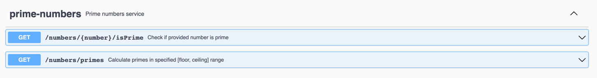

# prime-numbers service

## What does is do?
 1. generates prime numbers
 2. checks if provided number is prime 
 
## How to use it?

### Build & run locally
 * to build an application as far runnable JAR run ```mvn clean package```
 * to run an application: ```mvn clean spring-boot:run```

 * REST API will be exposed in: http://localhost:8081 


## Implementation details

 * Kotlin counterpart of [Java primes generation application](https://github.com/veretie/prime-numbers-java)
 * Uses number of Kotlin's features like data classes, immutable collections, companion objects, coroutines, etc. 